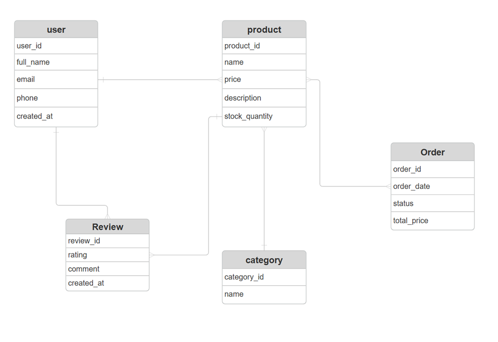

## Online Store Backend (MongoDB)

# Project Goal

The goal of this project is to design and implement a non-relational database using MongoDB for an online store system. The system supports user authentication, product management, order processing, and customer reviews. MongoDB was chosen due to its flexibility, scalability, and ability to efficiently handle nested and referenced data.

## Relevance of the Topic

Modern e-commerce platforms require high performance, scalability, and flexible data structures. Using a NoSQL database allows efficient handling of complex data relationships such as embedded order items and referenced entities like users and products.

## Why MongoDB (NoSQL)

MongoDB provides:

Flexible schema design

Horizontal scalability

High performance for read-heavy applications

Support for embedded documents and references

These features make MongoDB suitable for e-commerce systems.

## Data Model Design

Users — stored as a separate collection

Categories — referenced by products

Products — reference categories

Orders — embed product snapshots

Reviews — reference users and products

Embedding is used for orders to preserve historical data, while referencing is used to avoid duplication and ensure consistency.

## CRUD Operations

The system implements full CRUD operations:

Create, Read, Update, Delete for Products and Categories

Create and Read for Orders

Create, Read, and Delete for Reviews

All operations were tested using Postman.

## Authentication & Authorization

JWT-based authentication

Role-based access control (user, admin)

Protected routes for administrative operations

## UML Diagrams

Use Case Diagram illustrates user and admin interactions

Sequence Diagram demonstrates order creation flow

## Technologies Used

Node.js

Express.js

MongoDB

Mongoose

JWT Authentication

## Conclusion

This project demonstrates the design and implementation of a MongoDB-based backend system with a well-structured data model, secure authentication, and efficient CRUD operations. The use of embedding and referencing highlights the advantages of NoSQL databases in real-world applications.